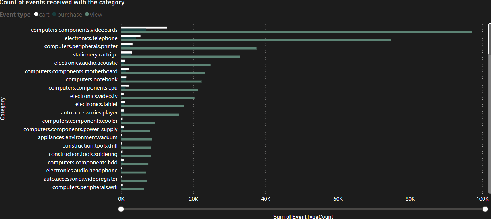
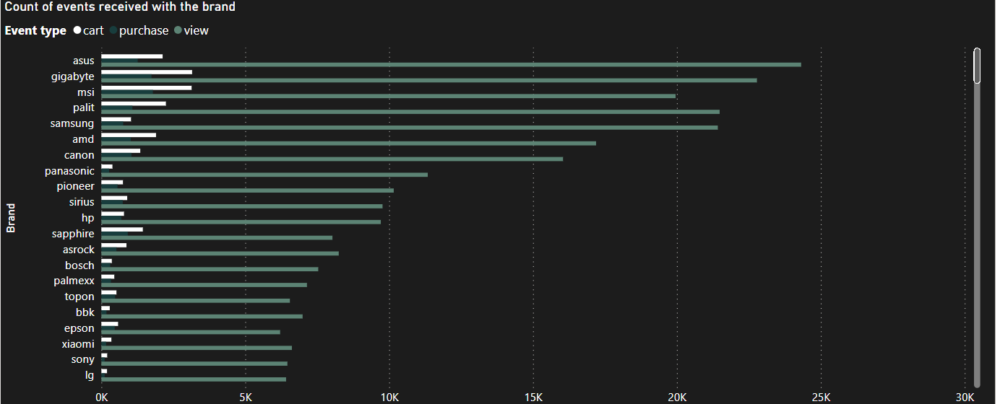
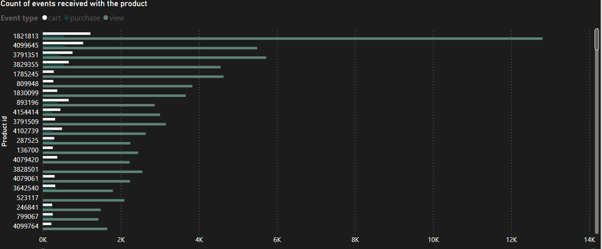
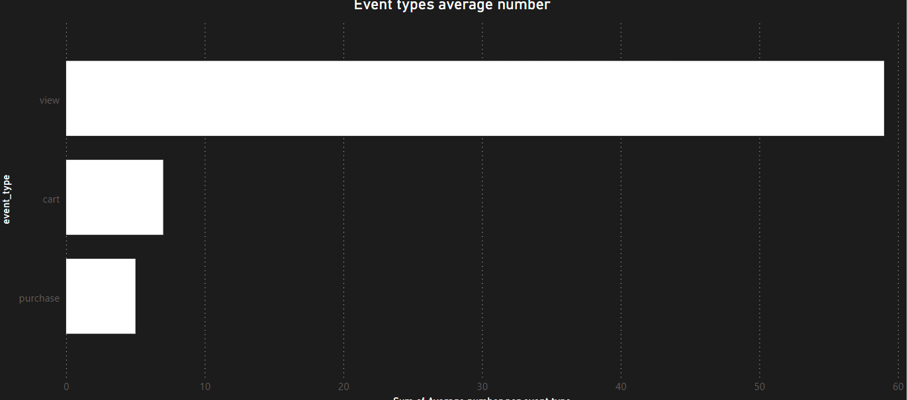
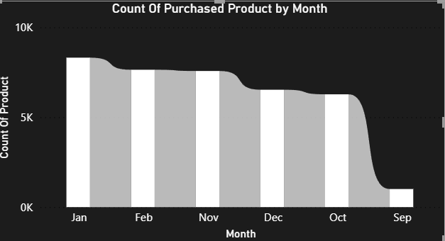
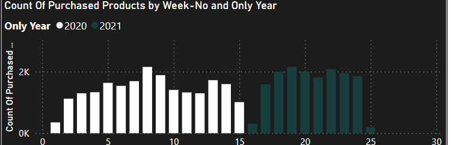
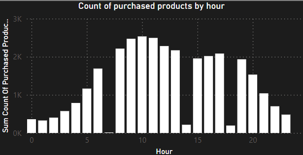
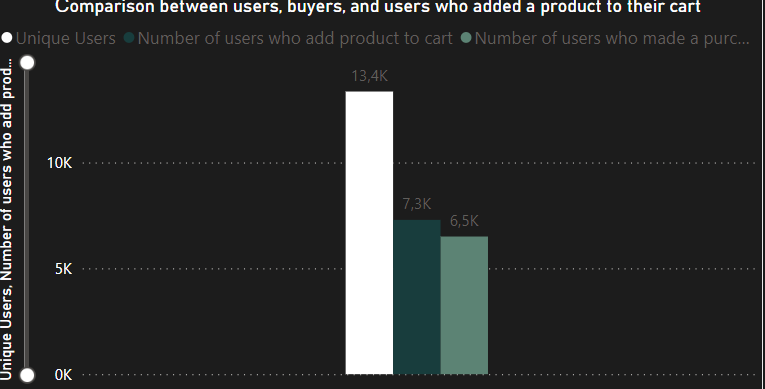
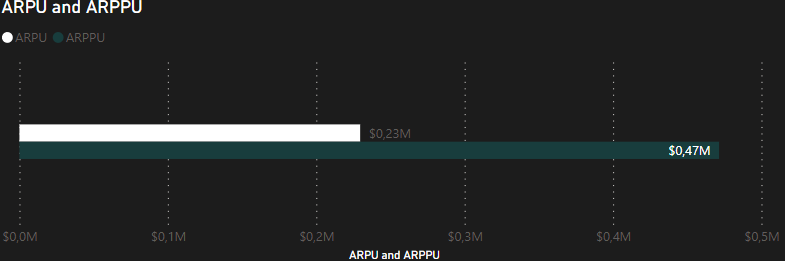
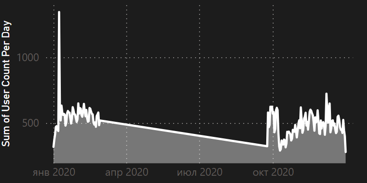

# <center>Ecommerce project

### <center> [Source](https://www.kaggle.com/datasets/mkechinov/ecommerce-behavior-data-from-multi-category-store)

The Ecommerce project aims to analyze user behavior data from a multi-category online store. This dataset, sourced from Kaggle, provides valuable insights into customer interactions with the platform, including browsing, cart additions, and purchases.


## <center>Objectives
* Analyze the effectiveness of marketing strategies.
* Identify popular products, categories, and brands.
* Understand user segmentation and engagement.
* Develop actionable insights to improve the ecommerce platform's performance and user experience?

## <center>Methodology
* Data preprocessing: Cleaning and preparing the dataset for analysis.
* Exploratory data analysis (EDA): Exploring key metrics and visualizing trends.
* Statistical analysis: Analyzing user behavior patterns and correlations.

## <center>Tools used 
* Excel
* SQL(MY SQL)
* Power BI


# <center>Dataset
### Columns  in table

* event_type = type of event(purchase,view or cart) that do user
* event_time = time when event was
* product_id = product id
* category_id = category id
* category_code = category of product
* brand = product brand
* price = price of product
* user_id = user id
* user_session = user session

# <center> SQL query
* First of all, i formatting  some rows in original data
``` sql 
--Remove from event_time 'UTC' for convert to datetime2
UPDATE ecommerce
SET event_time = REPLACE(event_time, ' UTC', '')

--Remove all ',' from price to convert to float
UPDATE ecommerce
SET price = LEFT(price, CHARINDEX(',', price + ',') - 1)
```
## <center> Product, Brand and Category

* Analyze purchase event data to identify the most popular products, product categories, and brands.
``` sql

--Categories
select category_code,
       event_type,
       count(event_type) as EventTypeCount from ecommerce
where category_code is not null
group by category_code,event_type
order by  count(event_type) desc

--Products
select top 500 product_id,
       event_type,
       count(event_type) as EventTypeCount from ecommerce
group by product_id,event_type
order by count(event_type) desc


--Brands
select brand,  event_type,
       count(event_type) as EventTypeCount from ecommerce
where brand != 'NULL'
group by brand,event_type
order by count(event_type) desc
```

## Result in chart


### Category sales

* `computers.components.videocards` are most popular in all 3 event type


## Brand sales

* `Asus` brand are most viewed 
* `gigabyte` brand are the most cartable products
* `msi` most saleble



## Product sales

* Product with `1821813` id(computers.components.videocards) most viwed and cartble 
* `4099645`(computers.components.videocards) most saleble


## As you see, `view`  type event in general occurs more often than other types
Let check this observation

``` sql
;with CountOfEventType as (
    select Count(event_type) as CountTypeCount,
           event_type, user_id  from ecommerce
    group by event_type,user_id
)

SELECT event_type, avg(CountTypeCount) as [Average number per event type]
FROM CountOfEventType
group by event_type
```



`View` occurs 8.4 times more than `cart` and 11.8 than `purchase` in avarege

<br>

## Sales by price category
```sql
SELECT top 10 price as Price, COUNT(product_id) AS [Product sales count] FROM ecommerce
WHERE event_type = 'purchase'
GROUP BY price, product_id
ORDER BY COUNT(product_id) desc
```

| Price | Product sales count |
| :--- | :--- |
| 292.83 | 564 |
| 32.22 | 543 |
| 397.48 | 538 |
| 204.29 | 423 |
| 214.1 | 384 |
| 26.19 | 345 |
| 294.41 | 266 |
| 13028 | 261 |
| 202.67 | 257 |
| 29.22 | 242 |


# Sales by month

* Peek sales was in january
* Least product sold in september

# Sales by week

```sql
SELECT
    DATEADD(dd, DATEDIFF(dd, 0, event_time), 0) AS event_day,
    COUNT(product_id) AS [Count Of Purchased Products]
FROM
    ecommerce
WHERE
    event_type = 'purchase'
GROUP BY
    DATEADD(dd, DATEDIFF(dd, 0, event_time), 0)
ORDER BY
    DATEADD(dd, DATEDIFF(dd, 0, event_time), 0)
```


In the chart, we can see sales in every week\
Most sold was in week 19(17-01-21 -- 23-01-21) - 2159 purchased product

## Sales by hour
``` sql
SELECT
    DATEPART(hour, event_time) AS Hour,
    COUNT(product_id) AS CountOfProduct
FROM
    ecommerce
WHERE
    event_type = 'purchase'
GROUP BY
    DATEPART(hour, event_time)
ORDER BY
    DATEPART(hour, event_time) asc
```


* As we see, at 6 o'clock in the morning it was sold out least product.\
I assume that everobody either sleep either getting ready for work.
* Peak sales occur at 10 a.m.\
I assume that most people take a short break at work, open their smartphone and check website like `Amazon`, `AliExpress` and etc 

## <center> Users
* Count of unique users(Total users)
``` sql
DECLARE @usersCount INT;
SET @usersCount = (SELECT COUNT(DISTINCT user_id) AS [Count Of Unique Users] FROM ecommerce);
select @usersCount AS [Count Of Unique Users]

--Then, let count users, who made at leat one purchase
DECLARE @buyersCount INT;
SET @buyersCount =  (
    SELECT COUNT(DISTINCT user_id) as [Number of users who made a purchase]
    FROM ecommerce
    WHERE event_type = 'purchase'
);

--Count of users, who added product to cart

select @buyersCount as [Number of users who made a purchase]

DECLARE @cartUsersCount INT;
SET @cartUsersCount =  (
 SELECT COUNT(DISTINCT user_id) as [Count of users who added to cart]
    FROM ecommerce
    WHERE event_type = 'cart'
);
select @cartUsersCount as [Count of users who added to cart]
```

<br>



## Conversion = `48,70 %`
## ARPU and ARPPU

```sql
--ARPU
declare @totalRevenue float;
set @totalRevenue = (select sum(price) as TotalRevenue from ecommerce)
select @totalRevenue;

DECLARE @usersCount2 INT;
SET @usersCount2 = (SELECT COUNT(DISTINCT user_id) AS CountOfUniqueUser FROM ecommerce);
select @totalRevenue/@usersCount2 as ARPPU;

--ARPPU
declare @totalRevenue2 float;
set @totalRevenue2 = (select sum(price) as TotalRevenue from ecommerce)
select @totalRevenue2;

DECLARE @buyersCount2 INT;
SET @buyersCount2 =  (
    SELECT COUNT(DISTINCT user_id) as [Number of users who made a purchase]
    FROM ecommerce
    WHERE event_type = 'purchase'
);

select @totalRevenue2/@buyersCount2 as ARPPU;
```


## DAU

```sql
select  DATEPART(month , event_time) [month],
        DATEPART(day , event_time) [day],
        count(distinct(user_id))  [user count per day]
from ecommerce
group by DATEPART(day , event_time),
         DATEPART(month , event_time)
order by  DATEPART(month , event_time),
          DATEPART(day , event_time)
```


### Top 5 most visited days

| month | day | user count per day |
| :--- | :--- | :--- |
| 1 | 8 | 1345 |
| 12 | 7 | 724 |
| 2 | 1 | 650 |
| 12 | 11 | 649 |
| 2 | 8 | 646 |
